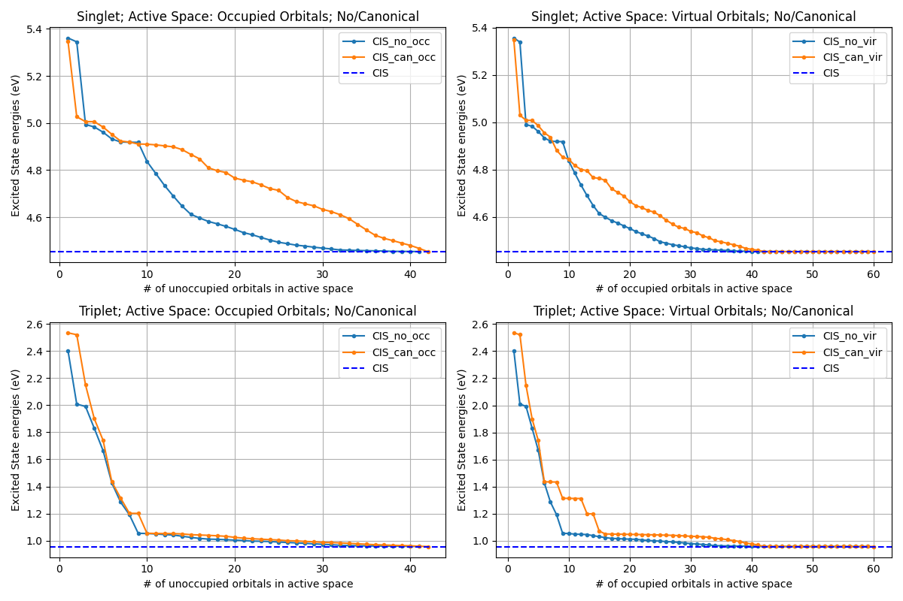

# Active Space Project

This project performs quantum chemistry calculations using the PySCF library. The main focus of this project is to generate active spaces and perform SCF (Self-Consistent Field) and CIS (Configuration Interaction Singles) calculations, including embedding potentials.

## Project Structure

```
ActiveSpace/
│
├── LICENSE
├── README.md
│
├── Tutorials/
│   └── activespace.ipynb        # Jupyter notebook tutorial
│
├── doc/
│   └── literature_review.pdf    # Background and theory about the project
│
├── src/
│   ├── __init__.py              # Initialize the module (if necessary)
│   ├── helper.py                # Core Python scripts for calculations
│   ├── rasci.jl                 # Julia script for RAS-CI
│   └── test.py                  # Test scripts for unit tests
│
├── data/                        # Contains output data, example files, and images
│   ├── plots/
│   │   └── ... (plot images)
│   ├── output/                  # All output files
│   ├── geometry/                # Store molecular geometry files
│   └── example/                 # Store example files
│
└── .gitignore                   # Add .gitignore to exclude __pycache__ and other unnecessary files
```

## Requirements

Before running the code, make sure the following dependencies are installed:

- Python 3.x
- NumPy
- Matplotlib
- PySCF

You can install the required libraries using pip:

```bash
pip install pyscf numpy matplotlib
```

## File Descriptions

- **`src/helper.py`**: This file contains the following classes and methods:
  - `Pyscf_helper`: Performs SCF calculations and CIS calculations for singlets and triplets.
  - `Active_space_helper`: Generates active spaces and calculates embedding potentials.
  - `Plot`: Utility for plotting the excitation energies of singlets and triplets.

- **`src/test.py`**: This script is used to test the methods implemented in `helper.py`. It performs SCF and CIS calculations for a water molecule and plots the results.

- **`geometry/`**: This folder contains the atomic geometry of the water molecule, which is used as input.
## How to Run the Code

1. **Prepare the Environment**:
   Ensure all required Python libraries are installed.

2. **Run the Tests**:
    Run the Tests: You can run the test.py script without Active Space Helper to perform SCF calculations, configuration interaction calculations, and plotting.
   ```bash
   python src/test.py
   ```

3. **Expected Output**:
   The script will output the CIS singlet and triplet excitation energies for the specified molecule (water in this case). It will also generate a plot showing the excitation energies of singlets and triplets vs. the number of orbitals in the active space.

## Debugging Common Errors

- **Memory Leak Warning in NumPy**: If you encounter a memory leak bug with NumPy 1.16, it is recommended to downgrade to version 1.15:
  
  ```bash
  pip install numpy==1.15
  ```

- **Import Errors**: Ensure that the file structure is correct and that the `src` and `geometry` folders are in the correct locations. If you encounter module import errors, verify the Python `sys.path` includes the project directory.

## Example Output

After running `test.py`, you should see output similar to the following:

```
CIS Singlet Energy: 0.123 eV
CIS Triplet Energy: 0.101 eV
```

Here is an example of a plot generated by the script:



## Notes

- The project currently uses a water molecule geometry for testing purposes, but you can modify `geometry/water_geo.py` to include other molecular geometries.
- If you add other molecules or methods, ensure they are properly tested and added to the project structure.
